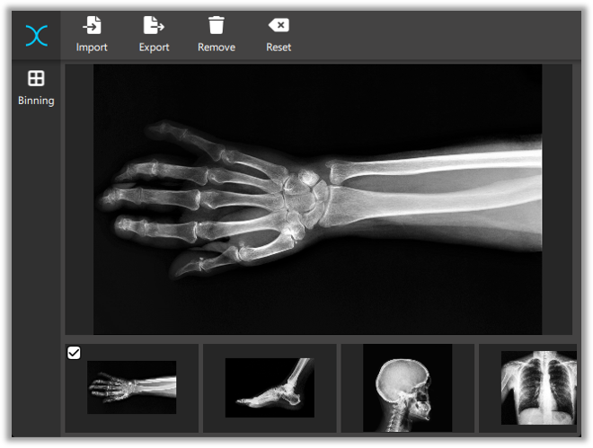

# X-ray Image Enhancer
 
X-ray image enhancing application can be used for modifying X-ray images for further processing.

## Platforms

The application is developed with Qt as a cross-platform desktop application.

## Library dependencies

For compiling, the libraries listed below are required. 
The application is developed using these versions.

- Boost 1.79
- OpenCV 4.6.0
- Qt 6.3 (open-source)

## Resources

- Fonts are free icons from https://fontawesome.com/
- Sample images are from https://stock.adobe.com/

## Improvement ideas

- Optimize binning algorithm for better performance
- Add more image enhancing methods
- Implement command-line interface
- Split unit tests to a file per test module
- Add integration tests for image reading and writing
- Add progress bar for exporting
- Show which images are modified
