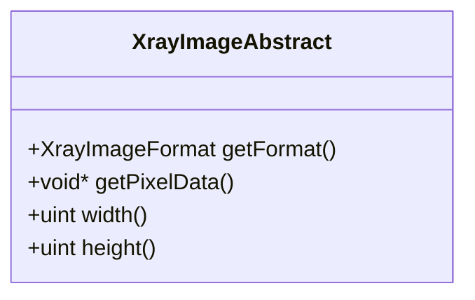
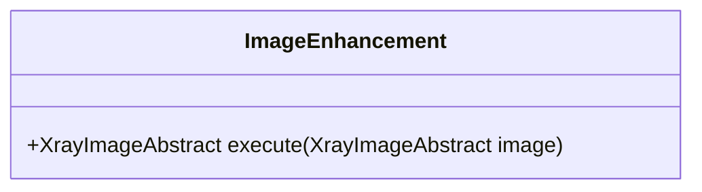
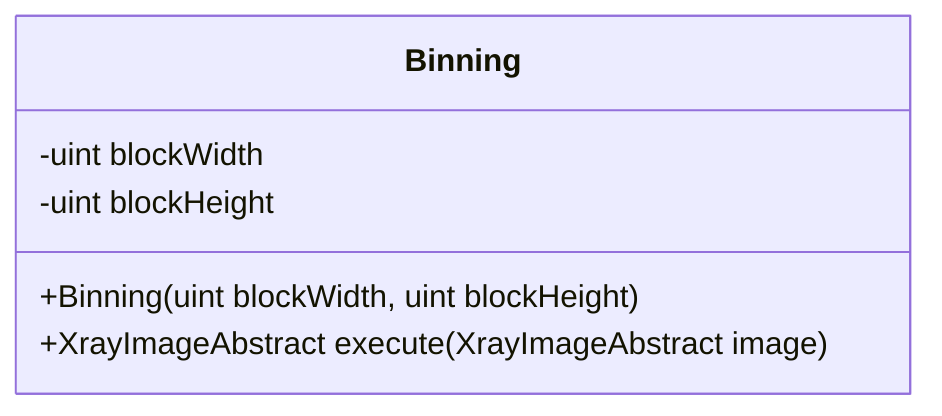
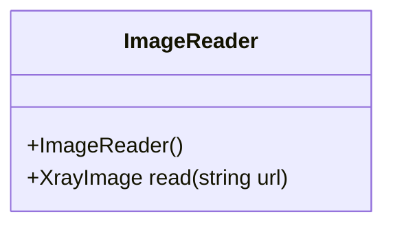
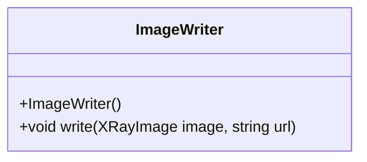

# Architecture

The architecture of the application is separated into layers:

- Domain - business objects and logic
- Service - application logic
- Infrastructure - persisting data
- Presentation - user interface

## Modules

### Imaging (imaging)

Imaging module contains domain objects related to imaging.

Layer: Domain

Abstract class for X-ray image defines common properties for images with different bit depths. Two implementations of the abstract class are 8-bit X-ray image and 16-bit X-ray image.

XrayImageFormat enum class defines 8-bit and 16-bit grayscale image formats.

### Image Processing (imageprocessing)

Image processing module contains algorithms for enhancing images.

Layer: Service

Abstract class for image enhancements allows implementing different types of image processing operations.

Binning class implements ImageEnhancement abstraction.

### Image Storing (imagestoring)

Image storing module is responsible in reading and writing images.

Layer: Infrastructure

### User interface (app)

User interface contains view for the application.

Layer: Presentation

## ImageItem

Contains data about each loaded image.
- ID of the image
- Original location of the image as URL
- Selected status
- Image enhancements applied to image

## ImageListModel

Abstract list model which handles image item list to be used in view.

## ImageFilterProxyModel

Model for filtering images for the view.

## ImageProvider

Provides images for the user interface and exporting as requested. 

## MainModel

Handles main application logic.

### Unit tests (tests)

Unit tests are written for domain objects and services.

- BinningTests
- XrayImageTests