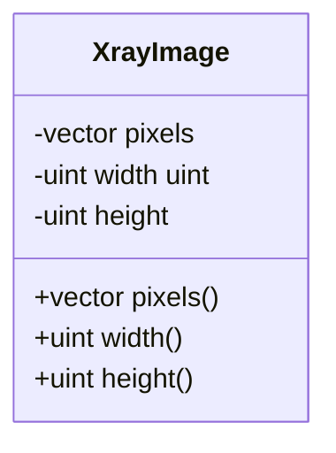
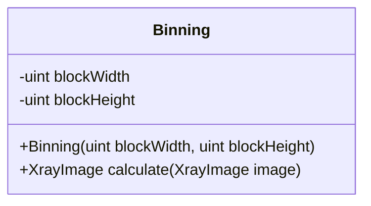
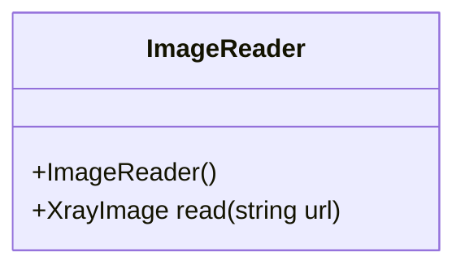
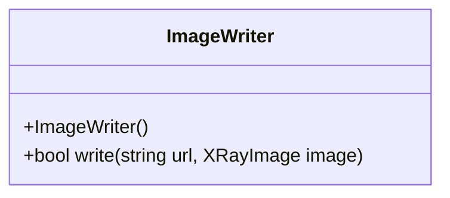
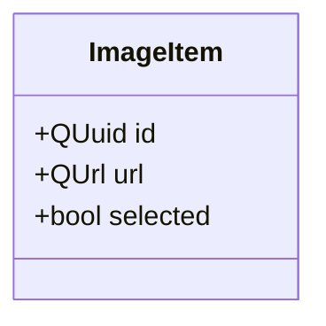
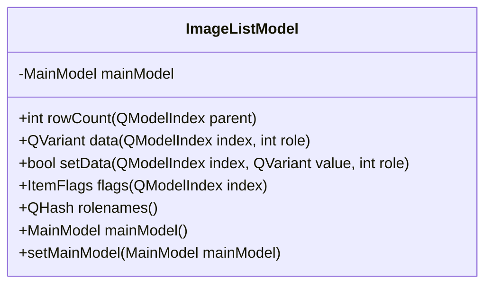
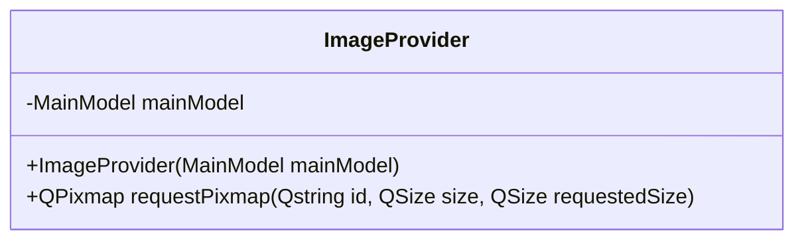
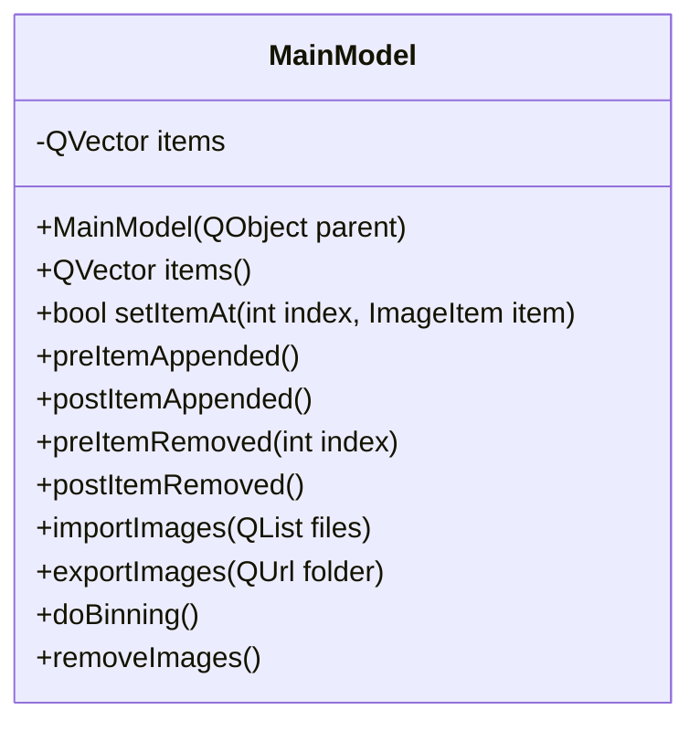

# Architecture

The architecture of the application is separated into layers:

- Domain - business objects and logic
- Service - application logic
- Infrastructure - persisting data
- Presentation - user interface

## Modules

### Imaging (imaging)

Imaging module contains domain objects related to imaging.

Layer: Domain

### Image Processing (imageprocessing)

Image processing module contains algorithms for enhancing images.

Layer: Service

### Image Storing (imagestoring)

Image storing module is responsible in reading and writing images.

Layer: Infrastructure

### User interface (app)

User interface contains view for the application.

Layer: Presentation

### Unit tests (tests)

Unit tests are written for domain objects and services.

- BinningTests
- XrayImageTests