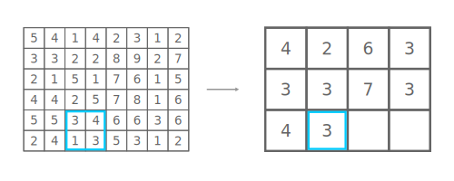

# Binning

Binning is an image processing method where blocks of adjacent pixels are combined. 
Typical block size is 2x2, where four adjacent pixels are combined into one pizel.

Binning can be used for reducing noise by improving signal-to-noise ratio.

An example of binning with 2x2 adjacent pixels is shown in the image below. 
The source image has gray-scale pixel values. A mask of size 2x2 is moved through the image pixels and 
pixels inside the mask are used for calculating the combined pixel value. In the example, we calculate 
the average of all pixel values. The calculated average pixel values are rounded to nearest integer.

Image 1. Binning with 2x2 adjacent pixels